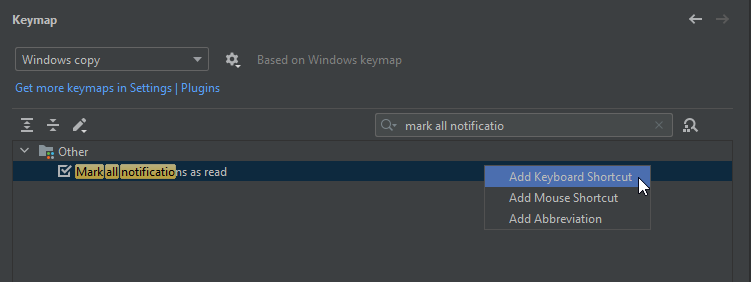

I am the one who worked a lot with JetBrains IDEs like Intellij and PyCharm. Many time when I wanted to play with git and terminal always lot of popups comes which hide my visibility with rest.

## Following is the steps to solve this - 
- Will going to set the new keymap for this purpose 

You can find "Mark all notifications as read" on others tab on keymap, like this

Add keyboard shortcut -> `Alt + c`

So on each time if any popup comes just used the same shortcut, will clear/hide sooner you use it.

Hope this will make you more productive in long ways, I am planning to share small ticks like this in future as well.

#### Note - never forget to open the firewall between your posgres server host and your client server on the mentioned postgres input.

