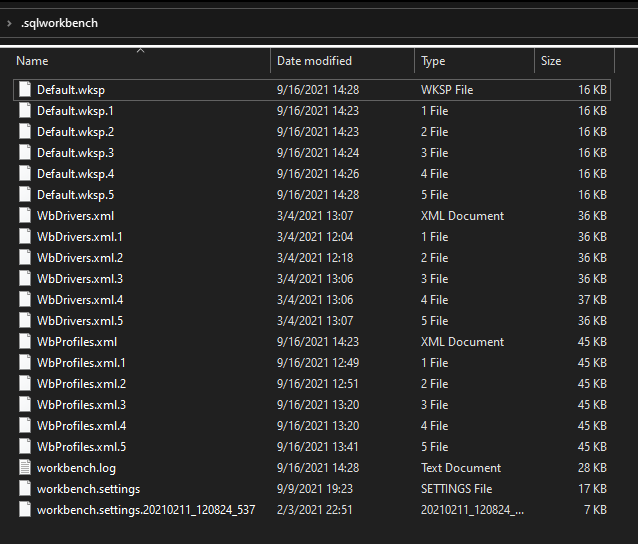

Being a *Data Engineer& I had to work a lot with databases. Over the time my best tool of choice is `SQL Workbench/j` as it is open source, fast and free.

I recently had to change my laptop due to some issue with my display, so I need to shift my entire deskspace from my laptopn to another and as I mentioned SQL workbench is not go to solution for this I had to made that shift from old PC to new one.

I did have google for this, sharing the best and easy solution I found.

Your client default location for sotring all the setting would be at __*C:\Users\YOUR-USER\\.sqlworkbench*__

What you need to do this, just copy all the containt from mentioned dir into your new workstation directory. I my case it looks likr this:

For more information about each file inside [refer this link](https://www.sql-workbench.eu/manual/install.html#config-dir)

> Hope this might have easy your life by one brick, for more productive post like this do visit my blog in future, I'll keep sharing all my ticks and shortcuts here, keep in touch see you again.